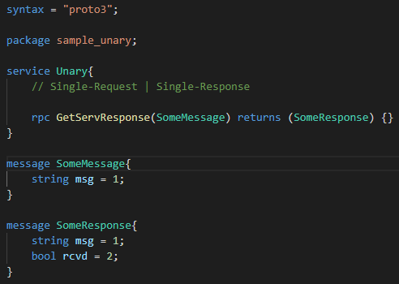

# Setup & Usage Guide

- Configure virtual environment

  ```powershell
  python -m pip install --upgrade pip
  python -m venv env
  ./env/Scripts/activate
  ```

- Installing gRPC toolkit

  ```powershell
  > python -m pip install grpcio
  > python -m pip install grpcio-tools
  ```

- Sample code:

  - The sample code for each category of communication between client and server is available in [grpc-dev](https://github.com/bnvsp/grpc-python/tree/grpc-dev) branch, clone it out for reference.

- Create `.proto` protobuf file

  

- Generate stubs using below command

  ```powershell
  > (env) python -m grpc_tools.protoc --proto_path=. --python_out=.\src\ --grpc_python_out=.\src\ .\protos\*.proto
  ```

- Generated Code from ProtoCompiler:

  - The protoc (Compiler) results in generating `*_pb2.py & *_pb2_grpc.py` for respective `.proto` file.

  - The generated code gets synthezied in `*_pb2.py` whereas gRPC specific code (data class) will be available in `*_pb2_grpc.py`.

  - Elements generated  in gRPC specific code:

    - **Stub (\*Stub):** The generated stub class will be used by gRPC clients. The stub objects are initialized with same names of corresponding methods defined as service in proto file.

    - **Servicer (\*Servicer):** Each service defined in proto file will generate a Servicer class which will be implemented by Server and each method defined in service must be overriden by Srrver class.

    - **Registration Function (add_\*_to_server):** Each service generates a function that needs to registered with `grpc.Server` object so that Server can address multiple services.

- Create Server service which uses generated stubs to take request as input and returns the response.

- Create Client service which uses generated stubs to send the request and wait for the response.

- **Enable Server Reflection**:

  - Install grpcio-reflection package

  ```powershell
  (env) > python -m pip install grpcio-reflection
  ```

  - Import reflection module `from grpc_reflection.v1alpha import reflection` in server code.

  - Configure reflection service by adding the service names

  ```python
    # Server Reflection
    server_names = (
        pb2.DESCRIPTOR.services_by_name['Unary'].full_name,
        reflection.SERVICE_NAME
    )
    reflection.enable_server_reflection(server_names, server)
  ```
