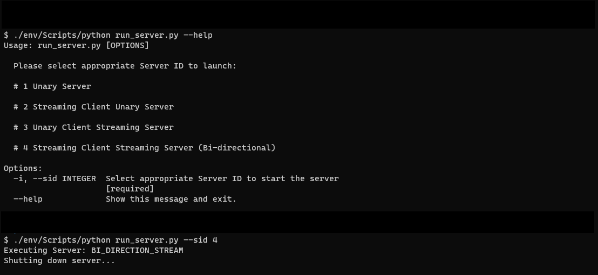
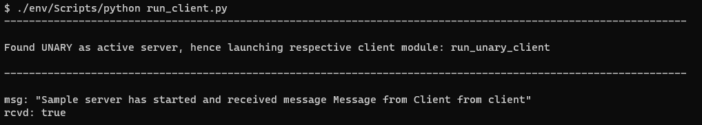

# gRPC - Python

- This repo deals with basic implementations for four categories of RPCs which also includes both client and server code.

  - [Unary](./src/unary/)
  - [Client Streaming](./src/stream_client/)
  - [Server Streaming](./src/stream_server/)
  - [Bi-direction Streaming](./src/stream_bi_directional/)

- Respective `.proto` files for each RPC implementation are available [here](./protos/)
- The source code also contains [stubs](./src/protos/) generated by `gRPC proto compiler`
- Please visit [Github Page](https://bnvsp.github.io/grpc-python/) to learn more about gRPC and configuring environment

## Usage

- Execute [run_server.py](./run_server.py), a CLI script, in a new terminal and select server from one of the listed categories.

- Running [run_client.py](./run_client.py) in another terminal will execute appropriate client mapped to active server running.

