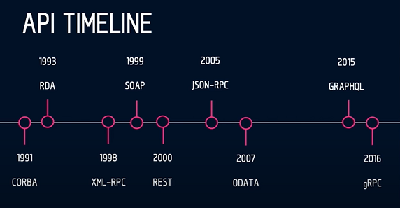
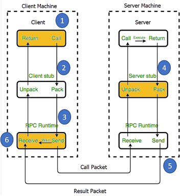

# API Timeline

## How RPC works

1. Client is configured with client stub and instance of RPC runtime to execute.
2. Client stub will be processed by passing parameters, the request along with metadata will be packed by the client stub. Client stubs also triggers local RPC runtime to process the metadata to server stub.
3. The RPC runtime manages in transmission of messages between client and server using the generated buffer code which will help in serializing/deserializing the transmitted message.
4. Upon completing the server procedure call, the server stub packs the message and triggers RPC runtime to perform the transmission to client
5. The transport layer (RPC Runtime) at server will send the message to RPC Runtime at client which will carry forward the deserialized message to client stub.
6. The client stub unpacks the message parameters and execution process will return to caller method.

## gRPC

- General purpose RPC (Remote Procedure Call) an open-source API framework developed by Google.

- Transport layer of gRPC is HTTP and implemented in HTTP/2 version.

- Protocol buffer is being used as default Interface Descriptive Language.
  - Schema is defined in `.proto` file, schema determines how data is being structured.
  - `protoc` is used to generate stubs (data access classes) for selected programming language by providing respective `.proto` file as input.
  - At runtime, messages are compressed and serialized in binary format.

- A Client-Response model that supports Data Streaming with Event Driven Architecture.
  - Uniary streaming. (Single Request-Single Response)
  - Server-side streaming.
  - Client-side streaming.
  - Bi-directional streaming

- Efficient Parsing: Since messages are transferred in binary format which reduces size of encoded message making it less CPU-intensive for pasring. This results in faster exchange of messages even with slower CPU devices.

- Essential Schema: By enforsing to adhere strict schema, this ensures data structure intact so that protobufs can concentrate more on serialization/deserialization.

## Advantages of using Protobuf

Please refer [Statistics](Statistics.md) for more details

## Configuring Python environment

Please refer [Configuration](Configuration.md) to setup `Python` environment and configure gRPC service

### References

- [altexsoft](https://www.altexsoft.com/blog/soap-vs-rest-vs-graphql-vs-rpc/)
